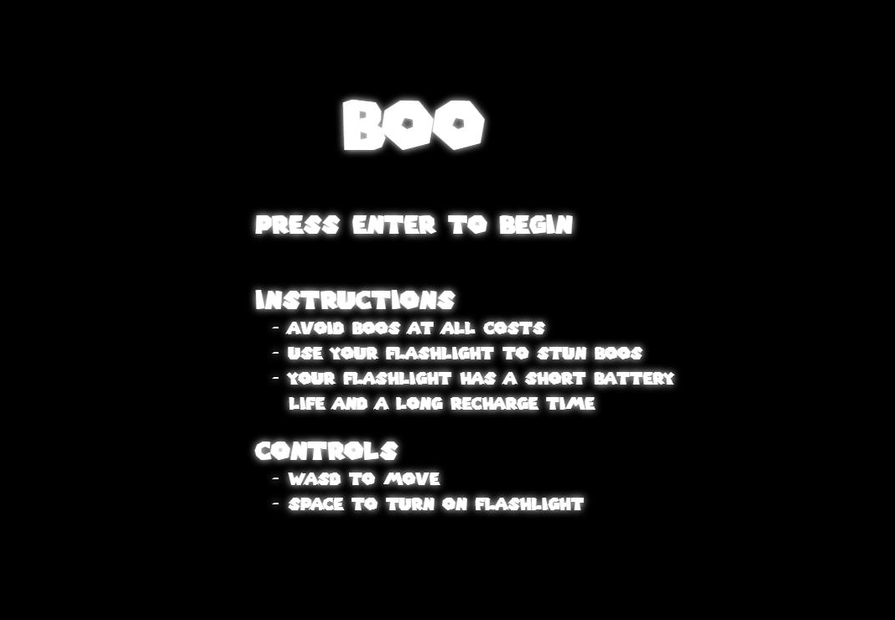
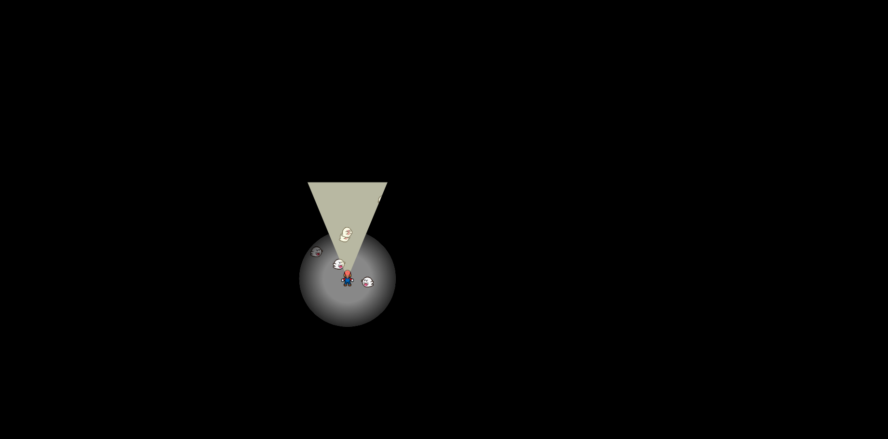
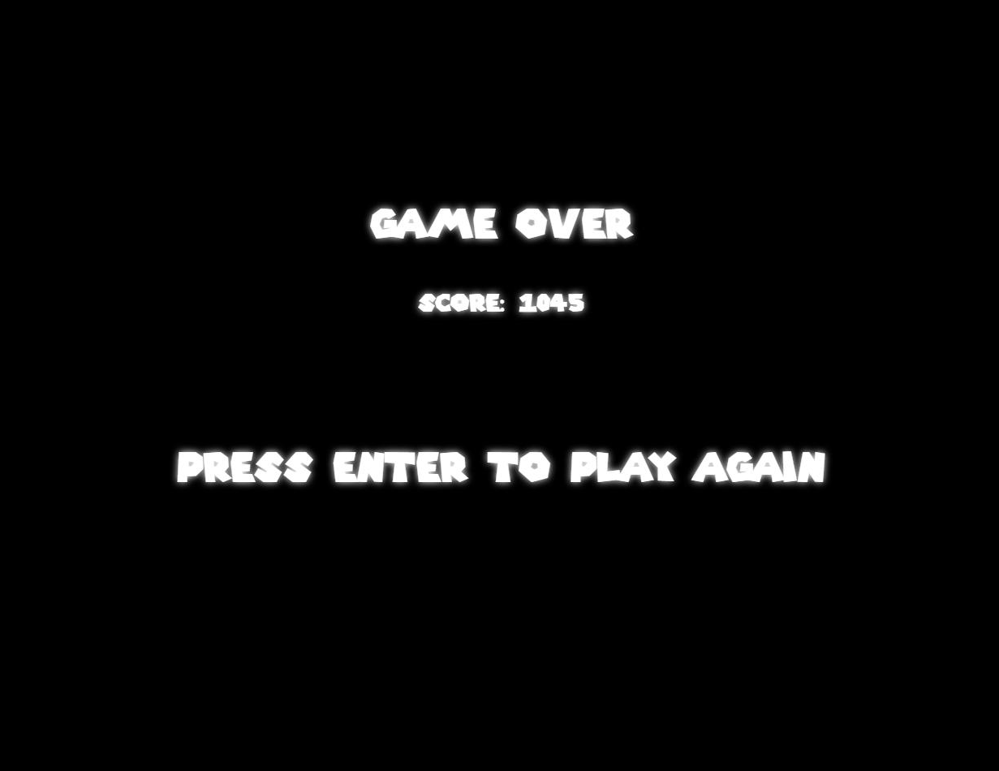

## Overview

Boo is a personal creation that uses the timeless characters from the Mario franchise to create a survival game. The whole goal is to avoid the numerous ghosts that constantly swarm you. The longer you survive, the higher your score. The player uses WASD for movement and the spacebar for his flashlight which is his only source of defense.

### Functionality and MVP Features

#### Functionality
* The player will use the arrow keys to control mario in 8 directions

* Ghosts will constantly spawn and chase Mario wherever he goes

* Using space will trigger Mario's flashlight which has a limited use before it needs to be recharged

### Wireframe


The app will initially consist of a welcome page which will display instructions and allows the player to start



Mario will start in the middle of the screen and will transverse the screen until he is caught



Upon being caught, the game over screen will appear and his score will be displayed and the user will be prompted to play again.

### Architecture and Technologies

#### Technologies 
* Vanilla Javascript
    * Clean, simple javascript 
    * used to create game logic and object oriented code
* Canvas
    * Renders our game and creates animations
    * Simplest and easiest to learn tool to render a simple javascript game
* Webpack
    * bundles multiple scripts into one accessible source
    * makes life a lot easier

#### Architecture
In addition to the webpack entry file, we will have four types of files:

Game logic: This will be contained in the game and gameview javascript files

Object logic: This will be contained in the mario, ghosts and moving objects files

### Code
By far, the hardest part to code was the flashlight. It had to be the perfect angle and had to follow Mario even when he was moving around the screen. After some clever trigonometric manipulation, I figured out the best way to implement it:

```JS
flashlight(ctx){
        //since the position of the sprite is based on the top-left corner, we have to add some pixels to find the middle of Mario
        let marioX = this.mario.pos[0] + 14;
        let marioY = this.mario.pos[1] + 20;
        let flashlightStartX;
        let flashLightStartY;
        let flashLightEndX;
        let flashLightEndY;

        //based on the direction that Mario is currently facing, draw the flashlight triangle with an internal angle of 45 degrees
        if (this.mario.direction === "down") {
            flashlightStartX = marioX - Math.tan(22.5 * Math.PI / 180) * 200;
            flashLightStartY = marioY + 200
            flashLightEndX = marioX + Math.tan(22.5 * Math.PI / 180) * 200
            flashLightEndY = marioY + 200
            ctx.lineTo(flashlightStartX, flashLightStartY)
            ctx.lineTo(flashLightEndX, flashLightEndY)
            ctx.moveTo(marioX, marioY)
            ctx.arc(marioX, marioY, 100, 3 * Math.PI / 8, 5 * Math.PI / 8);
        }
        else if (this.mario.direction === "downright") {
            flashlightStartX = marioX + Math.tan(22.5 * Math.PI / 180) * 200;
            flashLightStartY = marioY + 200
            flashLightEndX = marioX + 200
            flashLightEndY = marioY + Math.tan(22.5 * Math.PI / 180) * 200
            ctx.lineTo(flashlightStartX, flashLightStartY)
            ctx.lineTo(flashLightEndX, flashLightEndY)
            ctx.moveTo(marioX, marioY)
            ctx.arc(marioX, marioY, 100, Math.PI / 8, 3 * Math.PI / 8);
        }
        else if (this.mario.direction === "right") {
            flashlightStartX = marioX + 200;
            flashLightStartY = marioY + Math.tan(22.5 * Math.PI / 180) * 200;
            flashLightEndX = marioX + 200
            flashLightEndY = marioY - Math.tan(22.5 * Math.PI / 180) * 200
            ctx.lineTo(flashlightStartX, flashLightStartY)
            ctx.lineTo(flashLightEndX, flashLightEndY)
            ctx.moveTo(marioX, marioY)
            ctx.arc(marioX, marioY, 100, 15 * Math.PI / 8, Math.PI / 8);
        }
        else if (this.mario.direction === "upright") {
            flashlightStartX = marioX + 200;
            flashLightStartY = marioY - Math.tan(22.5 * Math.PI / 180) * 200;
            flashLightEndX = marioX + Math.tan(22.5 * Math.PI / 180) * 200
            flashLightEndY = marioY - 200
            ctx.lineTo(flashlightStartX, flashLightStartY)
            ctx.lineTo(flashLightEndX, flashLightEndY)
            ctx.moveTo(marioX, marioY)
            ctx.arc(marioX, marioY, 100, 13 * Math.PI / 8, 15*Math.PI / 8);
        }
        else if (this.mario.direction === "up") {
            flashlightStartX = marioX + Math.tan(22.5 * Math.PI / 180) * 200;
            flashLightStartY = marioY - 200
            flashLightEndX = marioX - Math.tan(22.5 * Math.PI / 180) * 200
            flashLightEndY = marioY - 200
            ctx.lineTo(flashlightStartX, flashLightStartY)
            ctx.lineTo(flashLightEndX, flashLightEndY)
            ctx.moveTo(marioX, marioY)
            ctx.arc(marioX, marioY, 100, 11 * Math.PI / 8, 13 * Math.PI / 8);
        }
        else if (this.mario.direction === "upleft") {
            flashlightStartX = marioX - Math.tan(22.5 * Math.PI / 180) * 200;
            flashLightStartY = marioY - 200
            flashLightEndX = marioX - 200
            flashLightEndY = marioY - Math.tan(22.5 * Math.PI / 180) * 200
            ctx.lineTo(flashlightStartX, flashLightStartY)
            ctx.lineTo(flashLightEndX, flashLightEndY)
            ctx.moveTo(marioX, marioY)
            ctx.arc(marioX, marioY, 100, 9 * Math.PI / 8, 11 * Math.PI / 8);
        }
        else if (this.mario.direction === "left") {
            flashlightStartX = marioX - 200;
            flashLightStartY = marioY - Math.tan(22.5 * Math.PI / 180) * 200
            flashLightEndX = marioX - 200
            flashLightEndY = marioY + Math.tan(22.5 * Math.PI / 180) * 200
            ctx.lineTo(flashlightStartX, flashLightStartY)
            ctx.lineTo(flashLightEndX, flashLightEndY)
            ctx.moveTo(marioX, marioY)
            ctx.arc(marioX, marioY, 100, 7 * Math.PI / 8, 9 * Math.PI / 8);
        }
        else if (this.mario.direction === "downleft") {
            flashlightStartX = marioX - 200
            flashLightStartY = marioY + Math.tan(22.5 * Math.PI / 180) * 200
            flashLightEndX = marioX - Math.tan(22.5 * Math.PI / 180) * 200
            flashLightEndY = marioY + 200
            ctx.lineTo(flashlightStartX, flashLightStartY)
            ctx.lineTo(flashLightEndX, flashLightEndY)
            ctx.moveTo(marioX, marioY)
            ctx.arc(marioX, marioY, 100, 5 * Math.PI / 8, 7 * Math.PI / 8);
        }

        //used to determine collision between flashlight and ghosts
        this.lightRange = { "point1": [marioX, marioY], "point2": [flashlightStartX, flashLightStartY], "point3": [flashLightEndX, flashLightEndY]}
    }
```

I also had to determine whether or not the ghosts collided with the flashlight.

I modelled the ghosts as points and had to determine whether or not these points were contained within the flashlight's triangle.
A triangle consists of three points. If a point is contained in the triangle, the sum of the three inner areas (which consists of the middle point and a combination of 2 of the 3 points that make the triangle) has to equal the area of the triangle that contains the point. I used this property to determine whether or not any of the boos were in the flashlight's scope.

```JS
checkInLight(point){
        //modelled the boo as a point in its middle
        point = [point[0]+10, point[1]+10]
        
        //made sure the flashlight was on and grabbed the 3 points of the flashlight 
        if (!this.mario.flashLightOn) return;
        let point1 = this.lightRange.point1
        let point2 = this.lightRange.point2
        let point3 = this.lightRange.point3

        //calculated the 4 different areas and compared them to see whether the boo was in the flashlight's range

        let mainArea = this.triangleArea(point1, point2, point3)

        let area1 = this.triangleArea(point1, point2, point);
        let area2 = this.triangleArea(point1, point3, point);
        let area3 = this.triangleArea(point2, point3, point);
        return (mainArea === area1 + area2 + area3)
}

triangleArea(point1, point2, point3){
    //determined area given the 3 points of a triangle using their coordinates
    let area = (point1[0]*(point2[1]-point3[1]) + point2[0]*(point3[1]-point1[1]) + point3[0]*(point1[1]-point2[1]))/2
    return Math.abs(area)
}
```